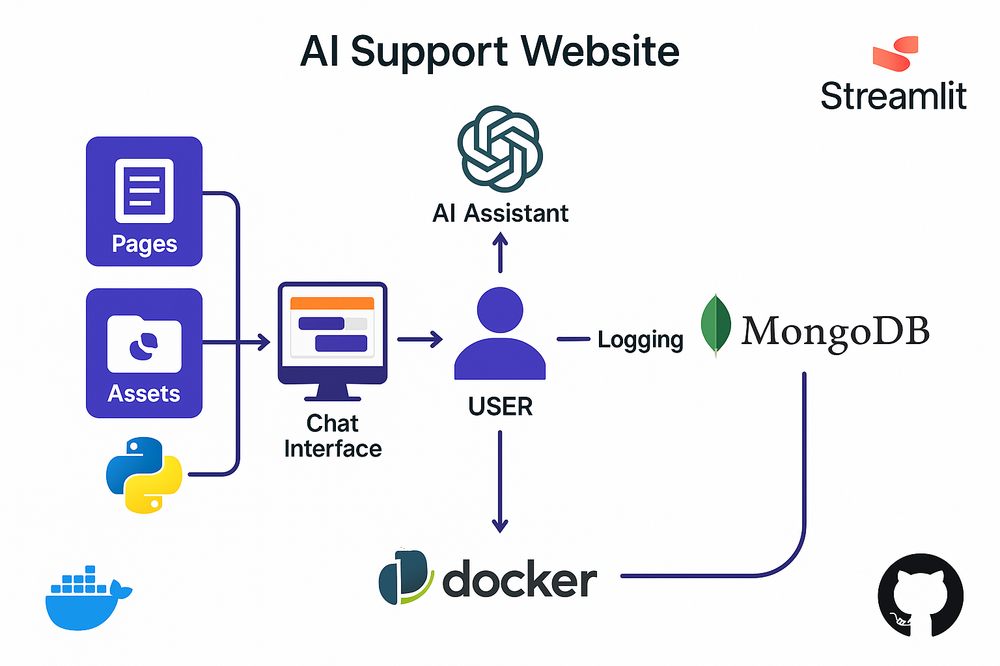

#  BrokeTechBro — AI Support Website

**BrokeTechBro** is a stylish, end-to-end AI-powered website that blends a website with an intelligent assistant. It's built to serve as a prototype for modern customer support experiences powered by OpenAI.

---

## 🔁 Diagram



---
## 🚀 Overview

BrokeTechBro is a multi-page Streamlit app featuring:

- 🏠 **Home** – The landing page with a floating chat button
- 👨‍💻 **About** – Intro and photo gallery
- ✉️ **Contact** – Reach out via email or LinkedIn
- 💬 **Chat Assistant** – Smart GPT-4o-based chat with rating, appointment, and MongoDB logging
- 📂 **Projects** – Dynamic project showcase from a JSON file

---

## 🔧 Tech Stack

- **Frontend**: [Streamlit](https://streamlit.io)
- **AI Backend**: [OpenAI Assistants API](https://platform.openai.com/docs/assistants)
- **Database**: [MongoDB Atlas](https://www.mongodb.com/atlas)
- **Assets**: Streamlit + CDN-hosted icons
- **Env Handling**: [python-dotenv](https://github.com/theskumar/python-dotenv)

---
## 💡 Features

- 💬 Conversational interface powered by OpenAI Assistant API (GPT-4o)
- 🗃️ MongoDB logging for session tracking, analytics, and feedback
- 🖼️ UI pages: Home, About, Projects, Contact, and a custom Chat interface
- ⭐ Session feedback and booking system built into the chat
- 📁 Organized asset folders for logos, icons, and user images
- 🐳 Docker-compatible for clean container deployment
- 🌐 Deployed on [Streamlit Cloud](https://streamlit.io/cloud)

---
## 📁 Project Structure

```
.
├── Home.py                  # Entry point
├── .env                     # Secret keys (not committed)
├── requirements.txt
├── README.md
├── assets/
│   ├── icons/               # Logo and favicons
│   ├── docs/                # projects.json, kb.json 
│   └── photos/
|       ├── about_photo/ 
|       ├── event_photo/
|       ├── project_photo / 
└── pages/
    ├── About.py
    ├── Contact.py
    ├── Projects.py
    └── _Chat.py             # Chat logic and MongoDB logging
```

---

## 💬 Chat Assistant Highlights

| Feature               | Description                                                                 |
|----------------------|-----------------------------------------------------------------------------|
| 🤖 GPT-4o Assistant   | Uses OpenAI Assistants API to provide conversational support                |
| 📝 Message Logging    | Saves chat sessions to MongoDB                                              |
| 📅 Appointment Form   | Lets users book support callbacks with phone, email & time preference       |
| ⭐ Rate Chat          | Likert scale rating feedback stored in database                             |
| ⛔ End Chat Button    | Ends chat session and shows social/dashboard footer                         |
| 📍 Floating Button    | Launch chat assistant from home page                                        |

---

## 🔐 Environment Variables (`.env`)

Create a `.env` file at the project root with the following keys:

```env
OPENAI_API_KEY=your-openai-api-key
ASSISTANT_ID=your-assistant-id

MONGODB_USERNAME=your-db-username
MONGODB_PASSWORD=your-db-password
MONGODB_HOST=your-cluster.mongodb.net
DB_NAME=your-db-name
COLLECTION=your-collection-name
```

> ⚠️ Never commit this file. It contains sensitive credentials.

---

## ✅ Getting Started

### 1. Clone this repo

```bash
git clone https://github.com/BlackIG/website.git
cd website
```

### 2. Setup a virtual environment

```bash
python -m venv venv
source venv/bin/activate  # Windows: venv\Scripts\activate
```

### 3. Install dependencies

```bash
pip install -r requirements.txt
```

### 4. Add your `.env` file

Use the keys above to configure MongoDB and OpenAI.

### 5. Run the app

```bash
streamlit run Home.py
```

---

## 📦 Sample `requirements.txt`

```txt
streamlit
openai
pymongo
python-dotenv
Pillow
```

---

## 💡 Use Cases

- 🔧 Developer portfolio with AI-powered support
- 🛒 eCommerce chatbot assistant
- 💬 Customer service prototype for fintechs or SaaS platforms
- 🧑‍🏫 Educational demo on how to build GPT assistants into Streamlit

---

## Deployed via Streamlit  
🔗 [https://thebroketechbro.streamlit.app](https://thebroketechbro.streamlit.app)

--

## 🙌 Author

**Ikechukwu Chilaka**  
Data Engineer & Customer Experience Technologist  
[LinkedIn →](https://www.linkedin.com/in/chilakaig)  
[Email →](mailto:chilaka.ig@gmail.com)

---

## 🏷️ License

This project is open source and available under the [MIT License](LICENSE).
